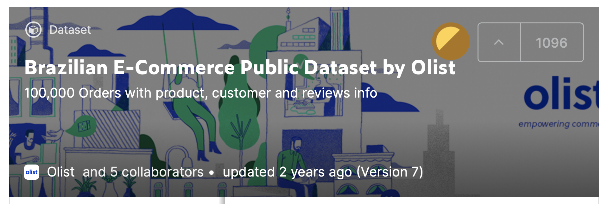

# 배송 시간 예측 워크샵
이 워크샵은 아래와 같은 모회사의 배송 예측에 대한 정보 입니다. "Kaggle의 Brazilian E-Commerce Public Dataset by Olist" 를 가지고 이 문제를 풀어 보겠습니다.

## 데이터 정보
- Brazilian E-Commerce Public Dataset by Olist
    - https://www.kaggle.com/olistbr/brazilian-ecommerce
    - 

## 문제 접근 방법
데이터가 여러개 항목의 CSV 로 구성 되어 있습니다.
- (0) 레이블 생성
    - CSV 파일에서 주문 확정 시간, 배송 도착 시간의 차이를 계산하여 배송 시간을 계산 합니다. 
    - 이 배송시간을 5개의 구간으로 나누어서 분류 문제로 만듧니다.
        - 0: 0 - 2일 (00:00:00 - 2일 23:59:59)
        - 1: 2 - 5일 (3일 - 5일 23:59:59) 
        - 2: 5 - 8일 (6일 - 8일 23:59:59)     
        - 3: 8 - 11일 (9일 - 11일 23:59:59)         
        - 4: 11 - 14일 (12일 - 14일 23:59:59)                 
- (1) 데이타 추출 및 준비    
    - 여러개의 CSV 파일에서 위의 레이블을 예측하기 위한 데이터 컬럼 값들을 조인 및 추출 합니다.
- (2) 데이터 탐색    
    - 추출된 데이터 컬럼 값을 탐색하여, 어떤 컬럼 값이 레이블의 영향을 주는지를 확인 합니다.
- (3) 피쳐 엔지니어링    
    - 피쳐 엔지니어링을 통하여, 새로운 피쳐를 생성 합니다.
- (4) 모델 빌딩, 훈련 및 평가    
    - 최종 피쳐를 통하여 아래 알고리즘을 갖고 훈련 및 모델 평가를 합니다.
        - Amazon AutoGluon
    - 위의 알고리즘이 제공하는 '피쳐 중요도' 를 보고 어떤 피쳐가 추론시 중요하게 영향을 미치었는지를 확인 합니다.
- **(5) 위의 (1)~(4) 까지를 원하는 모델 성능(에: Accuracy)이 나올때 까지 계속 반복 합니다.**        

## 노트북 설명
- **[필수]** 0.1.Install_Package.ipynb
    - 필요한 Python Package를 설치 합니다.(AutoGluon 등)
- [옵션] 1.0.Show_Raw_Data.ipynb
    - Kaggle에서 제공한 Raw 데이터를 확인 합니다.
- **[필수]** 1.1.Prepare_Data.ipynb
    - 여러개의 데이터 CSV 파일에서 필요한 컬럼만을 조인 및 추출 합니다.
- [옵션] 1.2.Explore_Data.ipynb
    - 데이터 탐색을 합니다.
- [필수] 1.6.Feature_Engineer.ipynb
    - 피쳐를 생성 합니다.
- **[필수]** 1.7.AutoGluon.ipynb    
    - AutoGluon Python Package로 훈련, 평가, 추론
- [옵션] 2.1.AutoGluon-MKP.ipynb
    - AutoGluon을 마켓플레이스에서 다운로드 받아 실행 합니다.
- [옵션] 2.2.AutoGluon-MKP-Prob.ipynb    
    - 위의 2.1 버전은 클래스의 분류 값(에: 0, 1) 을 제공하지만, 여기서는 확률값을 제공함.
- [옵션] 2.5.AutoGluon-BYOC.ipynb
    - AutoGluon을 Bring Your Own Container(BYOC)로 실행합니다.    
- [옵션] 3.1.Adv-Feature_Engineer.ipynb
    - 타겟 인코딩을 이용하여 피쳐를 생성 합니다.
- [옵션] 3.2.AutoGluon-FE.ipynb    
    - 타겟 인코딩으로 생성한 피쳐를 이용하여 AutoGluon으로 훈련 및 평가
- [옵션] 3.3.XGBoost.ipynb    
    - 타겟 인코딩으로 생성한 피쳐를 이용하여 XGBoost로 훈련 및 평가
- [옵션] 3.4.SM_XGBoost.ipynb
    - 타겟 인코딩으로 생성한 피쳐를 이용하여 SageMaker 내장 알고리즘인 XGBoost로 훈련 및 평가
- [옵션] 3.5.CatBoost.ipynb
    - 타겟 인코딩으로 생성한 피쳐를 이용하여 CatBoost로 훈련 및 평가    

    

# Reference:

- AutoGluon Tabular Prediction
    - 오토글루온 Tabular 공식 페이지
    - https://autogluon.mxnet.io/stable/tutorials/tabular_prediction/index.html
- SageMaker XGBoost Algorithm
    - SageMaker 내장 알고리즘 설명
    - https://docs.aws.amazon.com/sagemaker/latest/dg/xgboost.html
- XGBoost for Multi-class Classification
    - 블로그: SK Learn XGBoost 알고리즘을 end-to-end 설명
    - https://towardsdatascience.com/xgboost-for-multi-class-classification-799d96bcd368
    - Git Repo
        - https://github.com/ernestng11/touchpoint-prediction/blob/master/model-building.ipynb
- XGBoost Parameters
    - SK Learn XGBoost 파라미터
    - https://xgboost.readthedocs.io/en/latest/parameter.html#general-parameters
- CatBoost vs. Light GBM vs. XGBoost
    - CatBoost, Light GBM, XGBoost 를 비행기 지연 예측을 통해서 비교
    - https://towardsdatascience.com/catboost-vs-light-gbm-vs-xgboost-5f93620723db
- Feature Engineering
    - RecSys 2020 Tutorial: Feature Engineering for Recommender Systems
        - https://www.youtube.com/watch?v=uROvhp7cj6Q
    - Git Repo
        - https://github.com/rapidsai/deeplearning/tree/main/RecSys2020Tutorial
- Train and Deploy AutoGluon Models on Amazon SageMaker
    - https://medium.com/@elesin.olalekan/train-and-deploy-autogluon-models-on-aws-sagemaker-e68d876ed837