# 배송 시간 예측 워크샵
이 워크샵은 아래와 같은 모회사의 배송 예측에 대한 정보 입니다. "Kaggle의 Brazilian E-Commerce Public Dataset by Olist" 를 가지고 이 문제를 풀어 보겠습니다.


## 데이터 정보
- Brazilian E-Commerce Public Dataset by Olist
    - https://www.kaggle.com/olistbr/brazilian-ecommerce
    - 

## 문제 접근 방법
데이터가 여러개 항목의 CSV 로 구성 되어 있습니다.
- (0) 레이블 생성
    - CSV 파일에서 주문 확정 시간, 배송 도착 시간의 차이를 계산하여 배송 시간을 계산 합니다. 
    - 이 배송시간을 5개의 구간으로 나누어서 분류 문제로 만듧니다.
        - 0: 0 - 2일 (00:00:00 - 2일 23:59:59)
        - 1: 2 - 5일 (3일 - 5일 23:59:59) 
        - 2: 5 - 8일 (6일 - 8일 23:59:59)     
        - 3: 8 - 11일 (9일 - 11일 23:59:59)         
        - 4: 11 - 14일 (12일 - 14일 23:59:59)                 
- (1) 데이타 추출 및 준비    
    - 여러개의 CSV 파일에서 위의 레이블을 예측하기 위한 데이터 컬럼 값들을 조인 및 추출 합니다.
- (2) 데이터 탐색    
    - 추출된 데이터 컬럼 값을 탐색하여, 어떤 컬럼 값이 레이블의 영향을 주는지를 확인 합니다.
- (3) 피쳐 엔지니어링    
    - 피쳐 엔지니어링을 통하여, 새로운 피쳐를 생성 합니다.
- (4) 모델 빌딩, 훈련 및 평가    
    - 최종 피쳐를 통하여 아래 세가지 알고리즘을 갖고 훈련 및 모델 평가를 합니다.
        - CatBoost
        - XGBoost
        - Amazon AutoGluon
    - 위의 3개의 알고리즘이 제공하는 '피쳐 중요도' 를 보고 어떤 피쳐가 추론시 중요하게 영향을 미치었는지를 확인 합니다.
- **(5) 위의 (1)~(4) 까지를 원하는 모델 성능(에: Accuracy)이 나올때 까지 계속 반복 합니다.**        


## 피쳐 엔지니얼링 및 알고리즘 평가 
아래는 피쳐 엔지니어링의 및 세가지의 알고리즘 적용 효과를 요약 했습니다. 가장 하단 부터 보시면 시간 순의 실험한 것들을 볼 수 있고, 가장 최상단은 마지막 실험 결과를 의미 합니다.


### AutoGluon with target encoding with Smoothing, product_id/classes의 mean_smoothed, error_smoothed 피쳐 추가
```
accuracy: 0.92%
f1_score: 0.92%
```
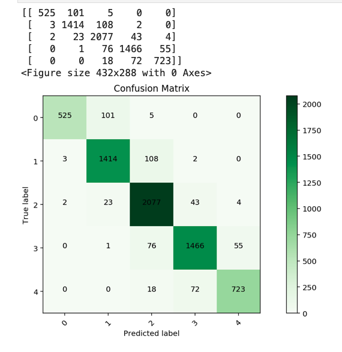

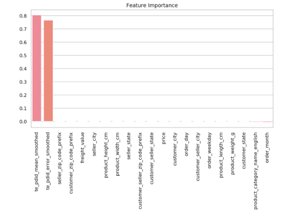

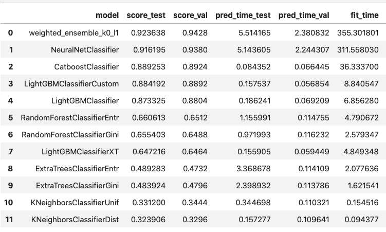


### XGBoost with target encoding with Smoothing, product_id/classes의 mean_smoothed, error_smoothed 피쳐 추가
```
accuracy: 0.77%
f1_score: 0.77%
```
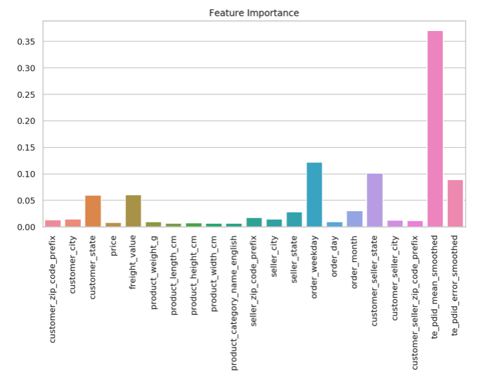


### CatBoost with target encoding with Smoothing, product_id/classes의 mean_smoothed, error_smoothed 피쳐 추가
```
accuracy: 0.90%
f1_score: 0.89%
```
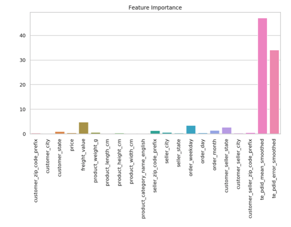


### CatBoost with target encoding, product_id/classes의 mean, count, error 피쳐 추가
```
accuracy: 0.95%
f1_score: 0.95%
```
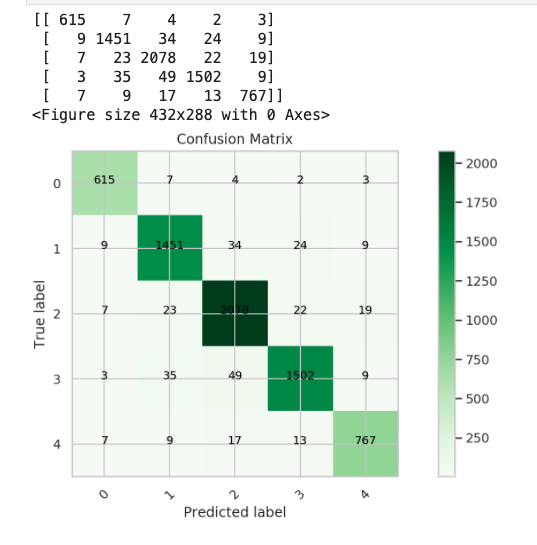


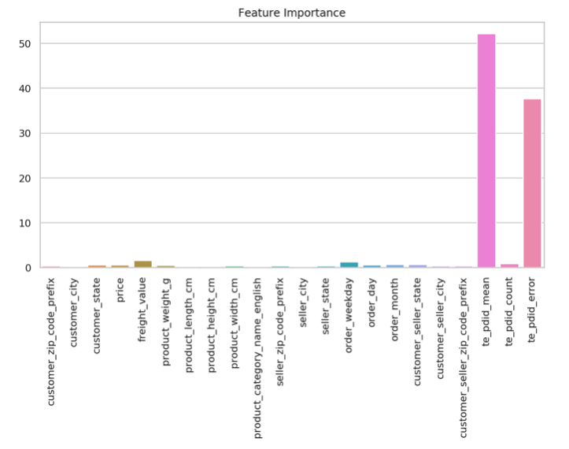


### AutoGluon with new features, product_id
```
accuracy: 0.48%
f1_score: 0.45%
```
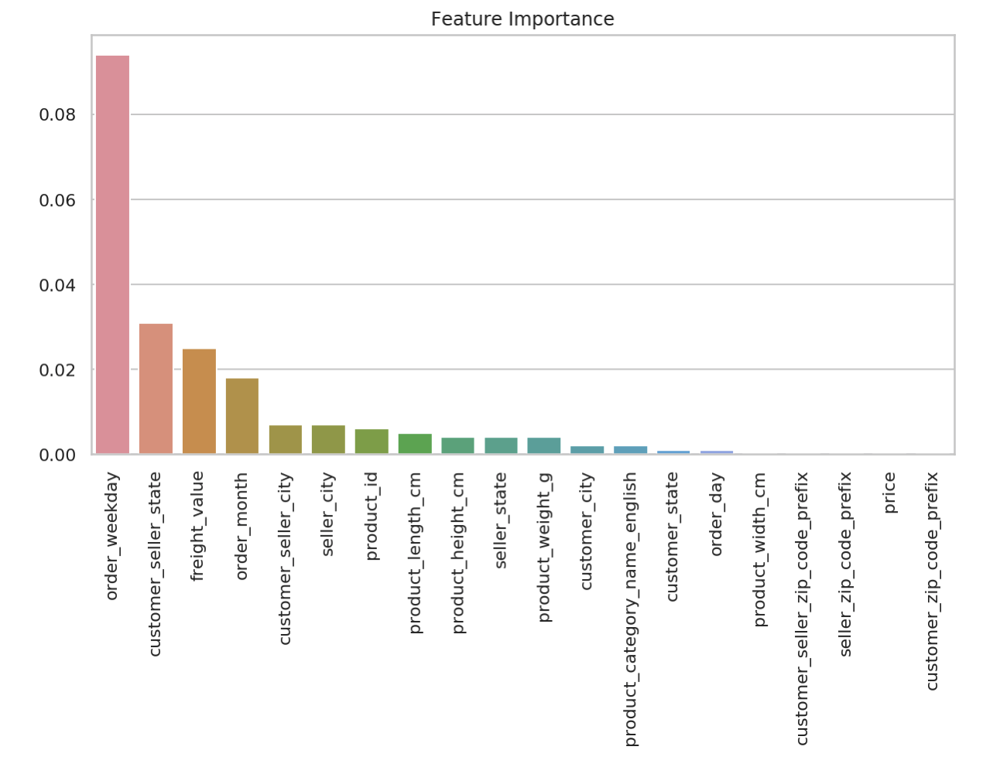


### CatBoost with new features, product_id
```
accuracy: 0.46%
f1_score: 0.43%
```
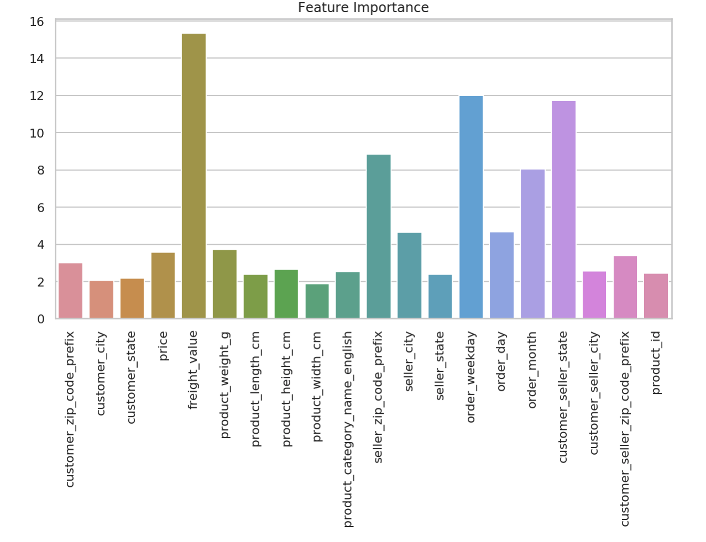


### CatBoost with new features (Month, Day, WeekOfDay)
```
accuracy: 0.46%
f1_score: 0.44%
```
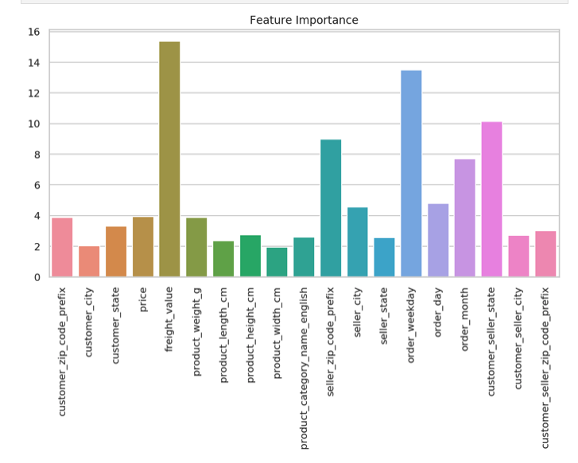


### CatBoost with new features, customer_seller_state, custom_seller_city, custom_seller_zipcode
```
accuracy: 0.39%
f1_score: 0.32%
```
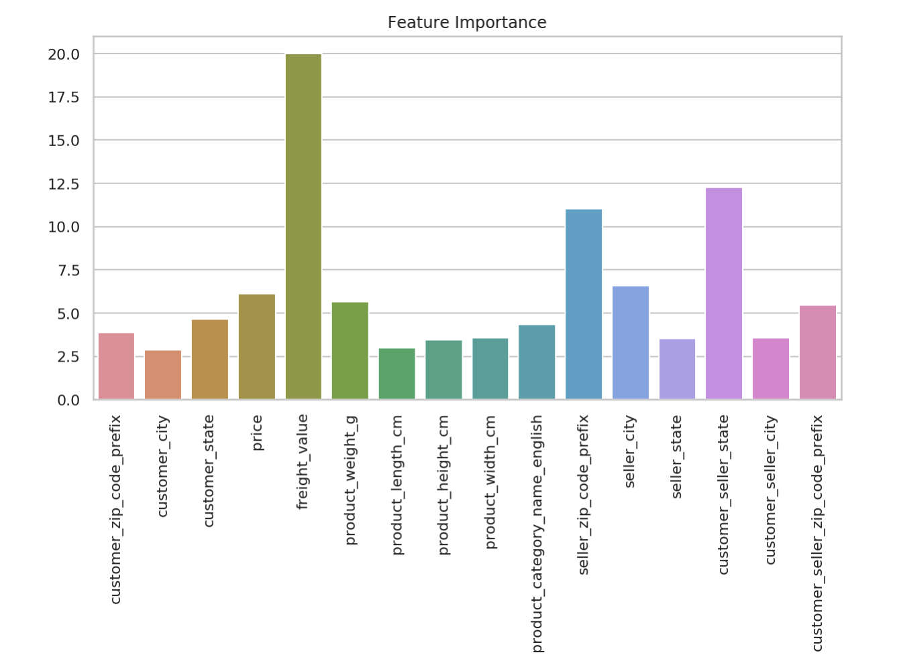


### AutoGluon with new features, customer_seller_state, custom_seller_city, custom_seller_zipcode
```
accuracy: 0.40%
f1_score: 0.29%
```
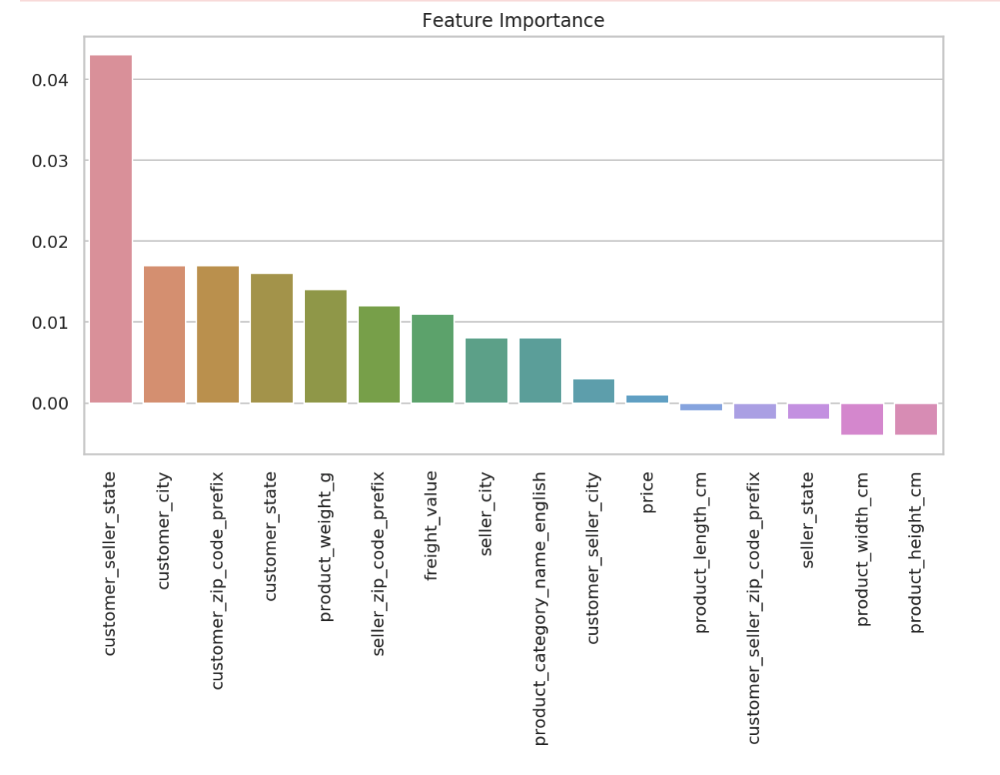

### XGBoost with new features, customer_seller_state, custom_seller_city, custom_seller_zipcode
```
accuracy: 0.39%
f1_score: 0.34%
```


### AutoGluon with new feature, customer_seller_state
    - cate_cols = ['customer_state','product_category_name_english','seller_state',customer_seller_state]
```
accuracy: 0.37%
f1_score: 0.30%
```
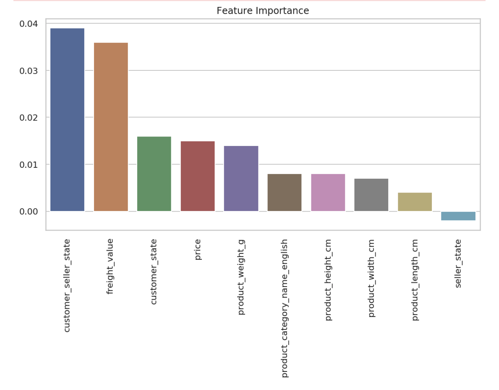


### CatBoost with new feature, customer_seller_state
    - cate_cols = ['customer_state','product_category_name_english','seller_state',customer_seller_state]
```
accuracy: 0.39%
f1_score: 0.28%
```


### XGBoost with new feature, customer_seller_state
    - cate_cols = ['customer_state','product_category_name_english','seller_state',customer_seller_state]
```
accuracy: 0.38%
f1_score: 0.31%
```
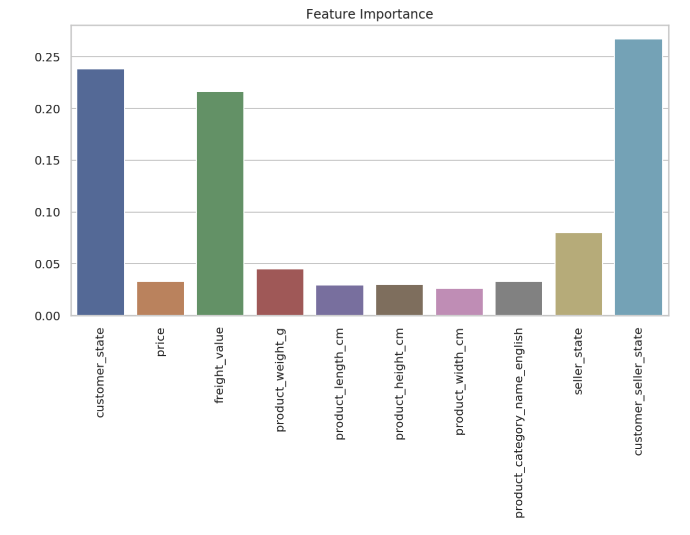


### CatBoost
    - cate_cols = ['customer_state','product_category_name_english','seller_state']
    - Encoding
        - Label Encoding    

```
accuracy: 0.38%
f1_score: 0.31%
```
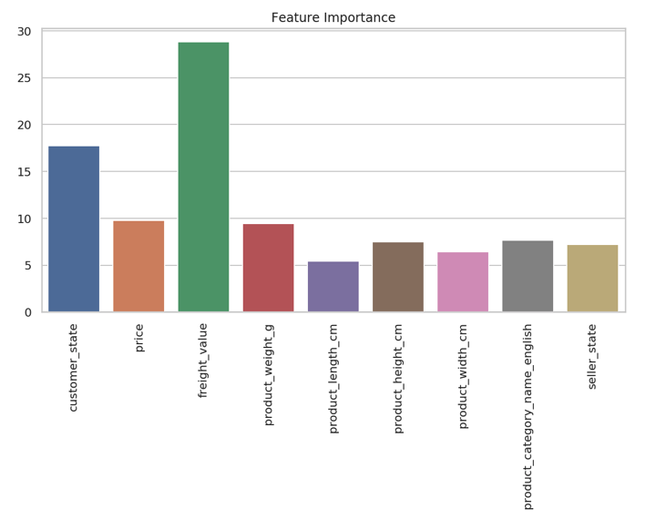


### AutoGluon with medium_quality_faster_train
    - cate_cols = ['customer_state','product_category_name_english','seller_state']
    - Encoding
        - No Encoding    

```
accuracy: 0.38%
f1_score: 0.27%
```
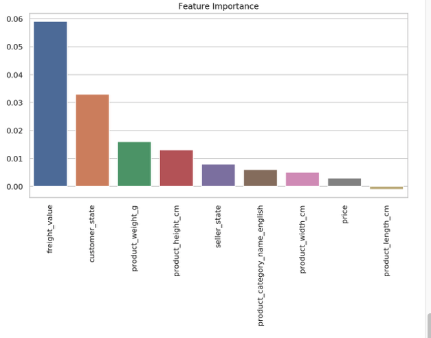

### XGBoost with Label-Encoding: 
    - cate_cols = ['customer_state','product_category_name_english','seller_state']
    - Encoding
        - Label-Encoding    
```
accuracy: 0.37%
f1_score: 0.29%
```
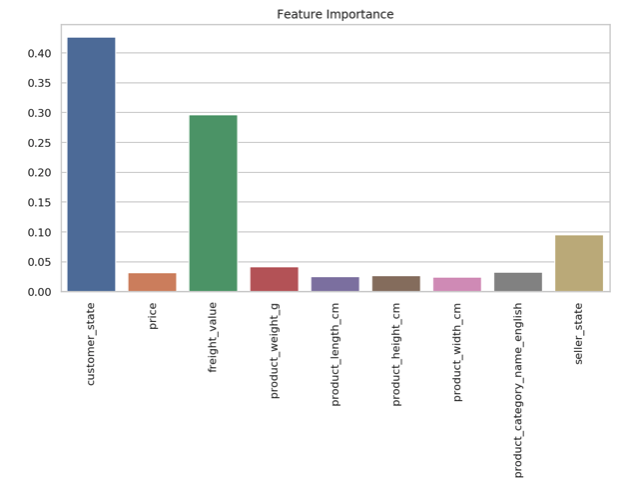

### XGBoost with One-Hot-Encoding: 
    - cate_cols = ['customer_state','product_category_name_english','seller_state']
    - Encoding
        - One-Hot-Encoding    
```
accuracy: 0.38%
f1_score: 0.31%
```

# Reference:

- AutoGluon Tabular Prediction
    - 오토글루온 Tabular 공식 페이지
    - https://autogluon.mxnet.io/stable/tutorials/tabular_prediction/index.html
- SageMaker XGBoost Algorithm
    - SageMaker 내장 알고리즘 설명
    - https://docs.aws.amazon.com/sagemaker/latest/dg/xgboost.html
- XGBoost for Multi-class Classification
    - 블로그: SK Learn XGBoost 알고리즘을 end-to-end 설명
    - https://towardsdatascience.com/xgboost-for-multi-class-classification-799d96bcd368
    - Git Repo
        - https://github.com/ernestng11/touchpoint-prediction/blob/master/model-building.ipynb
- XGBoost Parameters
    - SK Learn XGBoost 파라미터
    - https://xgboost.readthedocs.io/en/latest/parameter.html#general-parameters
- CatBoost vs. Light GBM vs. XGBoost
    - CatBoost, Light GBM, XGBoost 를 비행기 지연 예측을 통해서 비교
    - https://towardsdatascience.com/catboost-vs-light-gbm-vs-xgboost-5f93620723db
- Feature Engineering
    - RecSys 2020 Tutorial: Feature Engineering for Recommender Systems
        - https://www.youtube.com/watch?v=uROvhp7cj6Q
    - Git Repo
        - https://github.com/rapidsai/deeplearning/tree/main/RecSys2020Tutorial