## 피쳐 엔지니얼링 및 알고리즘 평가 

### AutoGluon with target encoding with Smoothing, product_id/classes의 mean_smoothed, error_smoothed 피쳐 추가
```
accuracy: 0.92%
f1_score: 0.92%
```
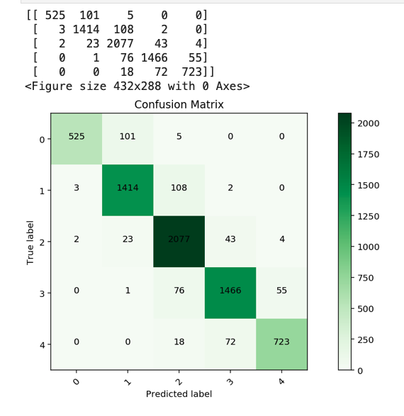

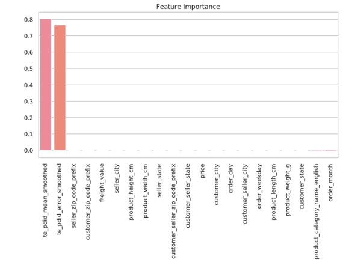

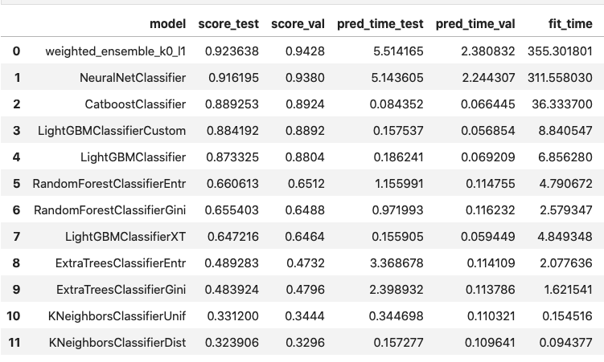


### XGBoost with target encoding with Smoothing, product_id/classes의 mean_smoothed, error_smoothed 피쳐 추가
```
accuracy: 0.77%
f1_score: 0.77%
```
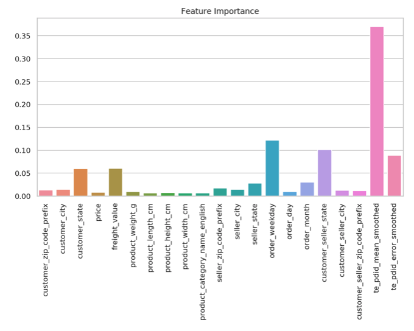


### CatBoost with target encoding with Smoothing, product_id/classes의 mean_smoothed, error_smoothed 피쳐 추가
```
accuracy: 0.90%
f1_score: 0.89%
```


### CatBoost with target encoding, product_id/classes의 mean, count, error 피쳐 추가
```
accuracy: 0.95%
f1_score: 0.95%
```
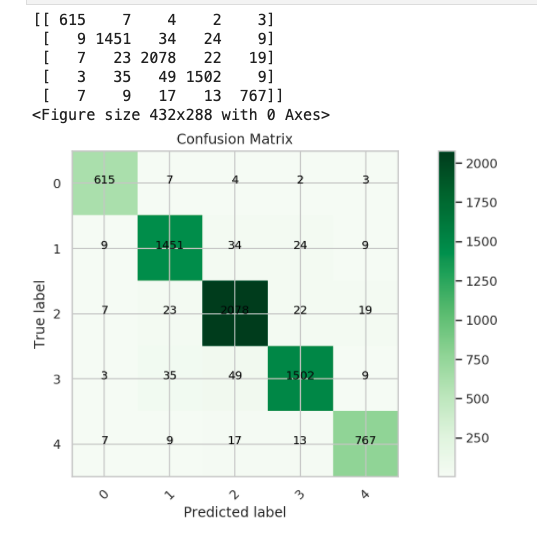


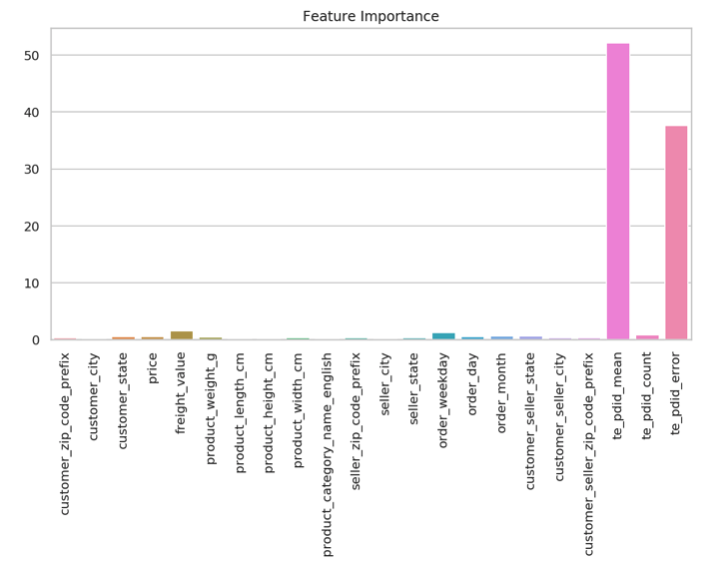


### CatBoost with date features (Month, Day, WeekOfDay)
```
accuracy: 0.46%
f1_score: 0.44%
```
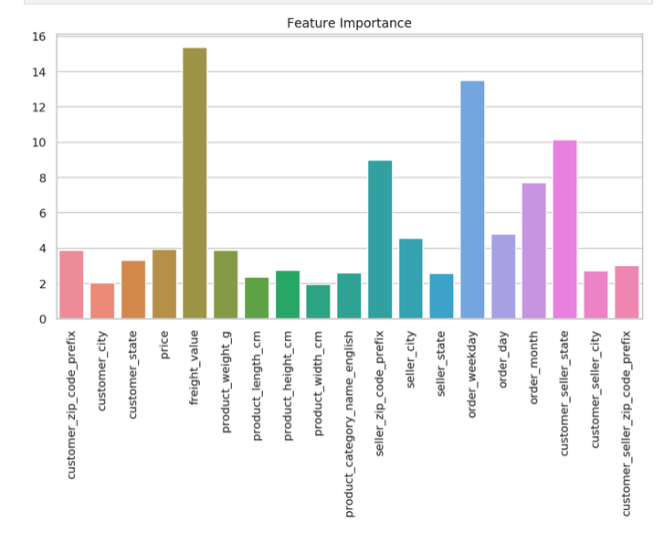


### CatBoost with date features, customer_seller_state, custom_seller_city, custom_seller_zipcode
```
accuracy: 0.39%
f1_score: 0.32%
```
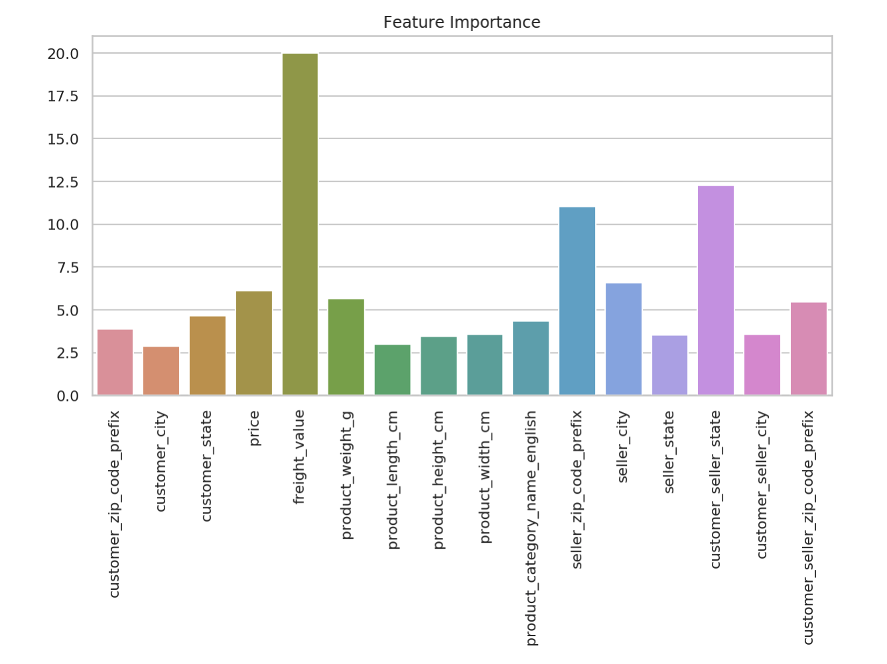


### AutoGluon with date features, customer_seller_state, custom_seller_city, custom_seller_zipcode
```
accuracy: 0.40%
f1_score: 0.29%
```
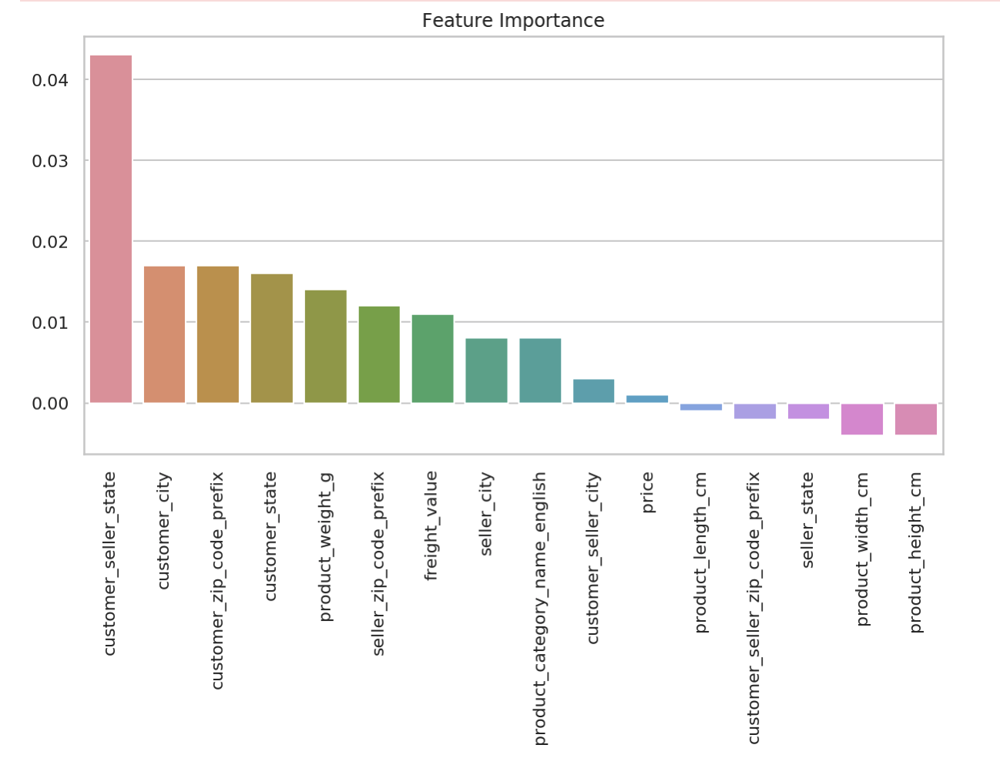

### XGBoost with date features, customer_seller_state, custom_seller_city, custom_seller_zipcode
```
accuracy: 0.39%
f1_score: 0.34%
```


### AutoGluon with date feature, customer_seller_state
    - cate_cols = ['customer_state','product_category_name_english','seller_state',customer_seller_state]
```
accuracy: 0.37%
f1_score: 0.30%
```
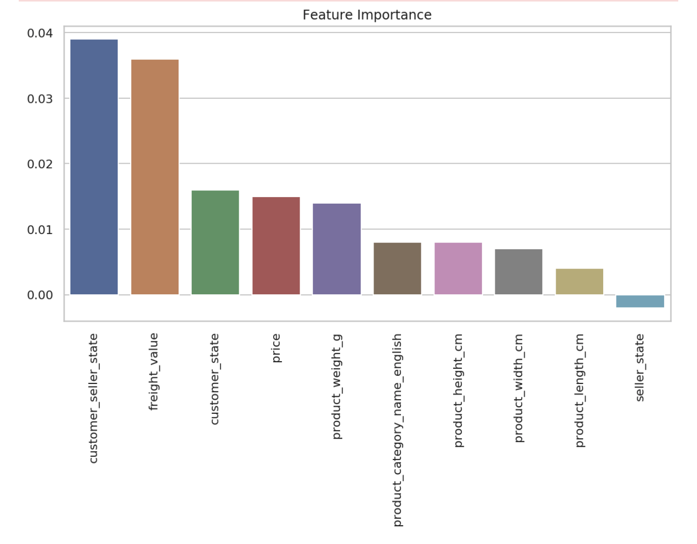


### CatBoost with date feature, customer_seller_state
    - cate_cols = ['customer_state','product_category_name_english','seller_state',customer_seller_state]
```
accuracy: 0.39%
f1_score: 0.28%
```


### XGBoost with date feature, customer_seller_state
    - cate_cols = ['customer_state','product_category_name_english','seller_state',customer_seller_state]
```
accuracy: 0.38%
f1_score: 0.31%
```
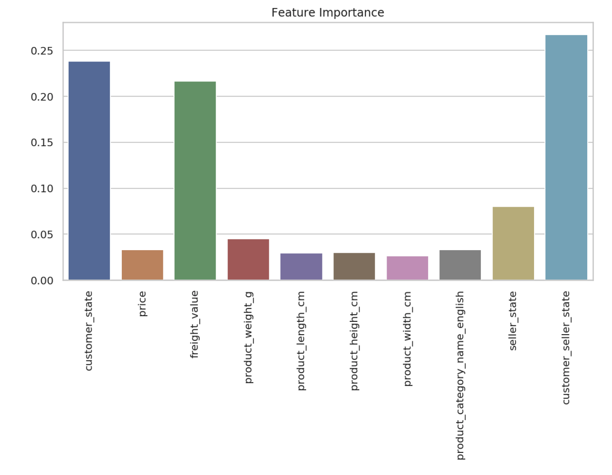


### CatBoost
    - cate_cols = ['customer_state','product_category_name_english','seller_state']
    - Encoding
        - Label Encoding    

```
accuracy: 0.38%
f1_score: 0.31%
```
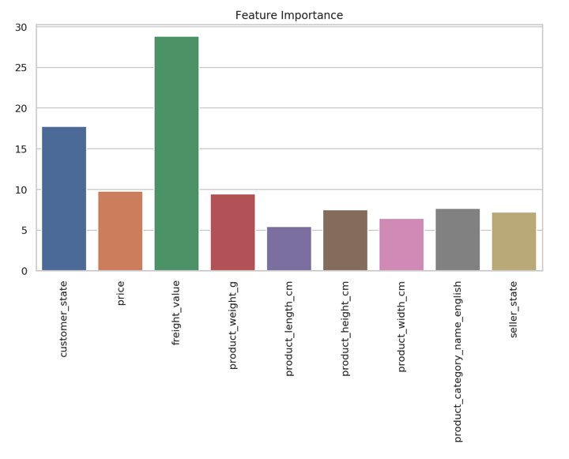


### AutoGluon with medium_quality_faster_train
    - cate_cols = ['customer_state','product_category_name_english','seller_state']
    - Encoding
        - No Encoding    

```
accuracy: 0.38%
f1_score: 0.27%
```
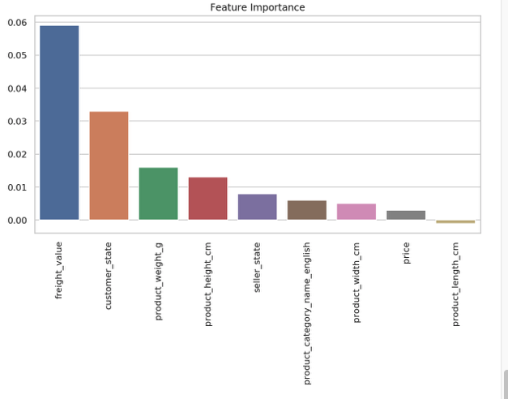

### XGBoost with Label-Encoding: 
    - cate_cols = ['customer_state','product_category_name_english','seller_state']
    - Encoding
        - Label-Encoding    
```
accuracy: 0.37%
f1_score: 0.29%
```
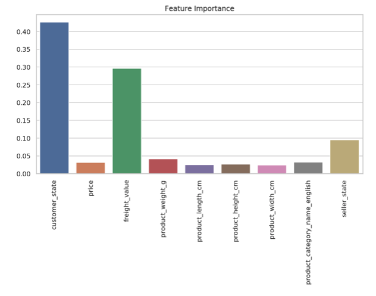

### XGBoost with One-Hot-Encoding: 
    - cate_cols = ['customer_state','product_category_name_english','seller_state']
    - Encoding
        - One-Hot-Encoding    
```
accuracy: 0.38%
f1_score: 0.31%
```

# Reference:

- Brazilian E-Commerce Public Dataset by Olist
    - 워크샵 사용 데이터
    - https://www.kaggle.com/olistbr/brazilian-ecommerce
- AutoGluon Tabular Prediction
    - 오토글루온 Tabular 공식 페이지
    - https://autogluon.mxnet.io/stable/tutorials/tabular_prediction/index.html
- SageMaker XGBoost Algorithm
    - SageMaker 내장 알고리즘 설명
    - https://docs.aws.amazon.com/sagemaker/latest/dg/xgboost.html
- XGBoost for Multi-class Classification
    - 블로그: SK Learn XGBoost 알고리즘을 end-to-end 설명
    - https://towardsdatascience.com/xgboost-for-multi-class-classification-799d96bcd368
    - Git Repo
        - https://github.com/ernestng11/touchpoint-prediction/blob/master/model-building.ipynb
- XGBoost Parameters
    - SK Learn XGBoost 파라미터
    - https://xgboost.readthedocs.io/en/latest/parameter.html#general-parameters
- CatBoost vs. Light GBM vs. XGBoost
    - CatBoost, Light GBM, XGBoost 를 비행기 지연 예측을 통해서 비교
    - https://towardsdatascience.com/catboost-vs-light-gbm-vs-xgboost-5f93620723db
- Feature Engineering
    - RecSys 2020 Tutorial: Feature Engineering for Recommender Systems
        - https://www.youtube.com/watch?v=uROvhp7cj6Q
    - Git Repo
        - https://github.com/rapidsai/deeplearning/tree/main/RecSys2020Tutorial